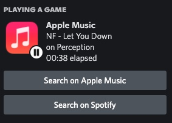
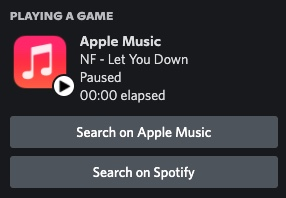
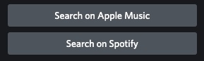

# **Apple Music Discord Rich Presence**

## **Contents**
1. Project Overview
2. App Features
3. App Installation

## **Project Overview**

This Discord Rich Presence is a bridge between the known social media [Discord](https://discord.com) and the commonly used music service [Apple Music](https://www.apple.com/apple-music/). Currently, Apple doesn't have [Discord Rich Presence](https://discord.com/rich-presence) built in by default into their Music and iTunes apps for MacOS and Windows by default, respectively, so this app was made to do just that. Other parties like Spotify have had full integration with Discord, so it's about time that something efficient is made for Apple Music.

### **Project Goals:**
* Efficient timing and re-calculation of song duration
* Update the status as efficiently as possible to prevent computer lag or fans turning on.

## **App Features**

### **1. Song Details**
  * Song name
  * song album
  * Song artist 

  

### **2. Song Paused Screen**
  * Displays that the song is paused and a "paused" image appears.
  * Hides Album name (unfortunately)

  

### **3. "Search [song] Button** 

  * Search for song on Apple Music website
  * Search for song on Spotify website

  

## **App Installation**

* ###  macOS 11+

  1. Go to [releases](https://github.com/rohilpatel1/Apple-Music-Rich-Presence/releases) and choose a version of your choice. It it highly encouraged that you choose the most recent version. 

  2. At the bottom of the release, where is says "Assets," choose the file that corresponds with your operating system (eg.  `darwin-x64.zip` corresponds with **macOS**)

  3. Download the file by clicking on it, and open the file in your **Downloads** folder, or the respective location of where your downloads go to.

  4. If needed, unzip the file so see the contents.

  5. Open the file and locate the "AppleMusicRPC" application inside. 

  6. Attempt opening the application. If it works, there you go! **If it doesn't work due to an "Unidentified Developer" error, continue reading.** 

  7. Drag the app into the "Applications" tab in Finder. 
  8. Locate the app once it is in the "Applications" tab. Right click on the app and click "Open" to view the app. Enjoy!

* ### Windows 7 / 10 / 11
  1. Go to [releases](https://github.com/rohilpatel1/Apple-Music-Rich-Presence/releases) and choose a version of your choice. It it highly encouraged that you choose the most recent version. 

  2. At the bottom of the release, where is says "Assets," choose the file that corresponds with your operating system (eg.  `win-x64.zip` corresponds with **windows**).
    - Note for the files there are two folders use the one that says `win32`

  3. Download the file by clicking on it, and open the file in your **Downloads** folder, or the respective location of where your downloads go to.

  4. If needed, unzip the file so see the contents.

  5. Open the folder (the one that says `win32`) and find "AppleMusicRPC.exe"

  6. Run the file and you are go to go! Running this file should automatically open up iTunes and hook into it. Enjoy!